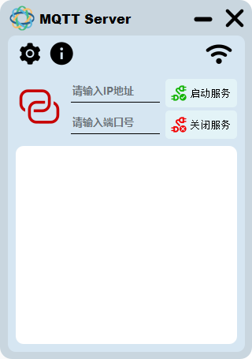
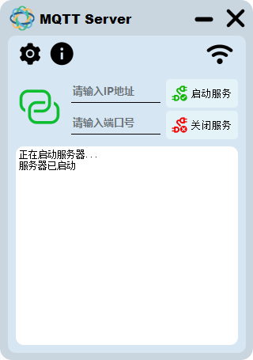
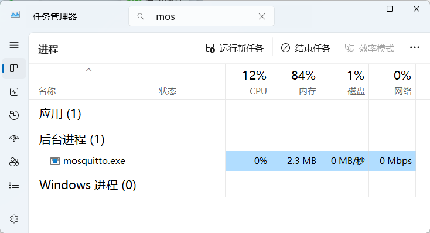
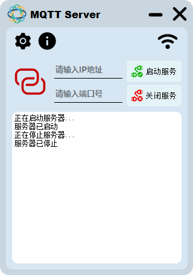
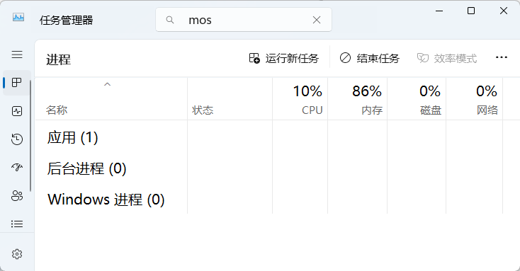
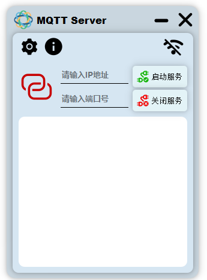
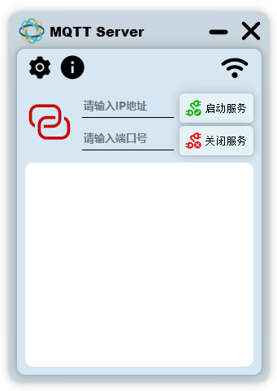
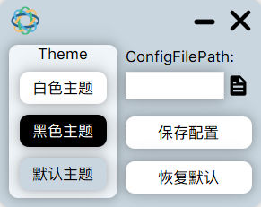
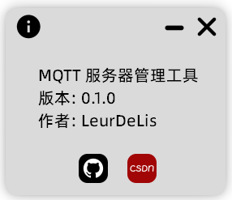

### 0、前言

> 该项目可作为学习PyQt5的入门项目
>
> 该MQTT服务器基于轻量化软件mosquito以及PyQt5界面库进行开发，方便快速搭建MQTT服务，相关功能正在开发中...

### 1、主界面

#### 1.1、简介

应用界面均已适配不同屏幕的分辨率，目前测试在1080P、2K屏幕均能正常显示，不会出现显示不完全的问题。

主界面包含如下内容：

1. 全局设置功能
2. 设备网络状态
3. 启动服务
4. 关闭服务
5. 服务状态
6. 关于应用

应用去掉了MainWindow状态栏以及默认背景，但是重写了窗口最小化、关闭窗口以及鼠标事件，依旧可以实现窗口最小化、关闭以及拖动窗口。

#### 1.2、服务启动状态

服务启动后，左侧的图标变绿，日志窗口打印日志信息，在不输入IP地址和Port端口号的情况下，MQTT服务器默认使用IP：127.0.0.1，Port：21883

服务启动后可以看到后台任务管理器中mosquito服务在运行

#### 1.3、服务关闭状态

服务关闭后，左侧的图标变红，日志窗口打印日志信息，同时后台任务管理器中mosquito服务已被关闭

#### 1.4、网络状态

应用启动时会检测当前的网络状态，如果没有网络只可以使用本地IP地址，仅在当前局域网内可以使用

##### 1.4.1、无网络状态

##### 1.4.2、有网络状态

### 2、设置界面

#### 2.1、简介

该界面可以设置应用的主题、自定义配置文件路径、可保存配置或者恢复默认配置。

### 3、关于应用界面

记录当前版本、作者、Github项目源码地址等

> **目前已实现基础功能，主题设置等相关功能以及界面优化正在开发中...**

